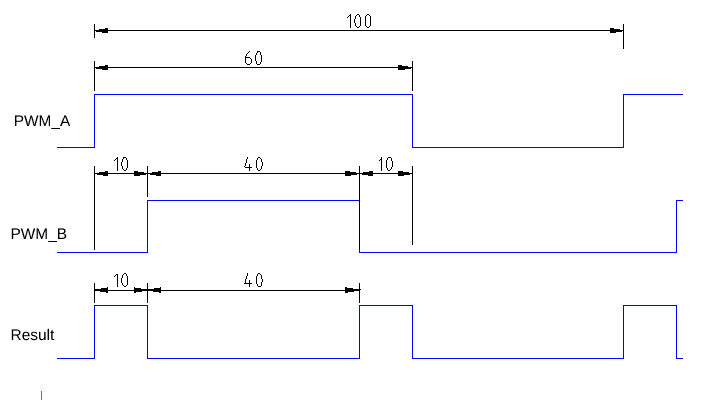
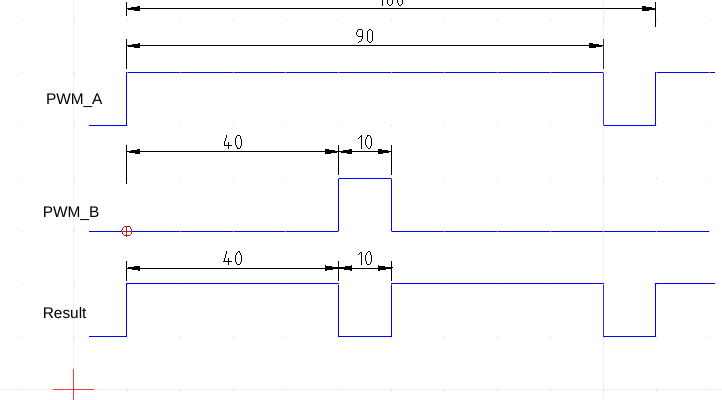

# weed_bed
esp32 driver  for weed-bed motor control using IBT_2

An IBT_2 is a driver with 2 halve H-bridges. You need to take care of timing between those two yourself. This makes it a bit more complicated, but on the other hand the driver is cheap. capable of a lot of current, protected for over current and over temperature.
This code is based on the well known Fast_PWM library.

We need to send a PWM signal to each of the half-bridges, also we have two PWM output pins (on the ESP32) for each motor. If we look at the timing for the two then:

For an outputPWM of 20% we do at channel-A an pwm with 60% and at channel-B 40% where B has a phase shift of 10%

For an outputPWM of 80% we do at channel-A an pwm with 90% and at channel-B 10% where B has a phase shift of 40%

Note that the output PWM has double the frequency of the individual channels.

In short we can say that if the output dutycycle (ODc) = 20% then Channel_A(ADc) needs to be 60% and BDc=40%+10%ps(phase shift)
or  CAd = 50% + ODc(with 05 phase shift)
and BDc = ODc - 10%(with ODc phase shift)

An ODc of 0% will then result in both A and B having the same 50% PWM.
And an ODc of 100% will be an A = 100% and B = 0%.

Reversing the motor can be done by swapping the PWM and phase-shift from A and B.
